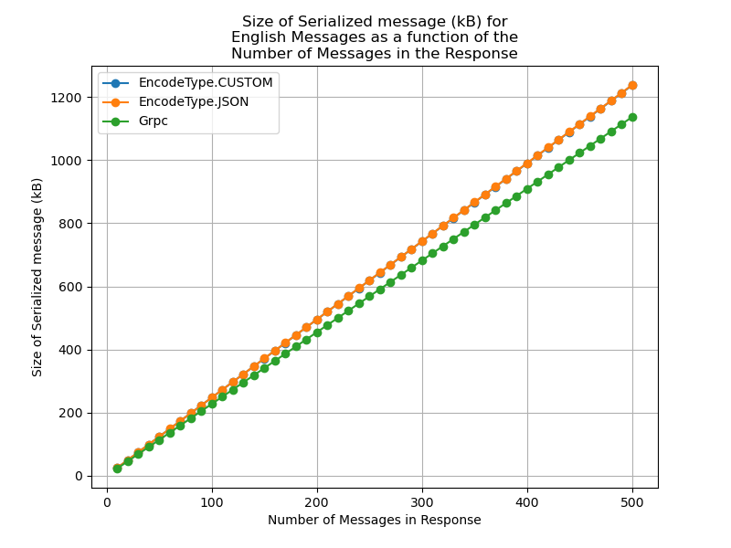
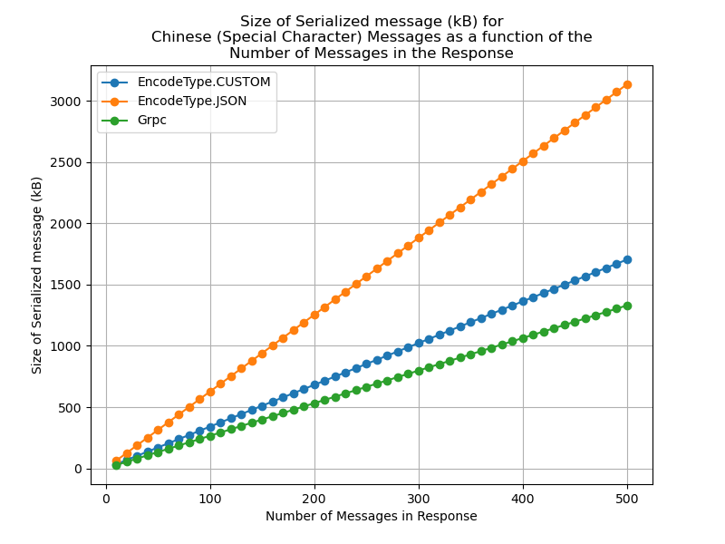

## Server-side Changes
So as to implement a Remote Procedure Call system for communication between the client and server, we choose to use gRPC, a library with ample documentation and code examples, making it easier to grasp, understand, and implement.

So as to expedite the process of implementing a simple gRPC protocol, we reduce the complexity of the server, while maintaining functionality. In particular, we rewrite the server such that there no longer exist dedicated user processes for each client. This eliminates the need for both the daemon process and for the user processes. As such, we have only a single database managing process. This greatly simplifies the implementation of gRPC, as the gRPC servicer class can now directly respond to requests by querying the database without needing to communicate with other processes.

Of particular note, we choose to make the server single-threaded, only instantiating a single worker. This is necessary given that because gRPC only instantiates a single servicer class, we must disable thread-checking in the SQLlite3 database, which asserts that multiple threads cannot access a single database access cursor. disabling thread-checking then necessitates that we as the developers rigorously prevent concurrency race-conditions. The easiest way to prevent this is to only have a single thread accessing the database, thus preventing concurrency issues by definition.

## Analysis of Difference
Overall, the main difference between gRPC and our custom and JSON wire protocols is that gRPC makes a specific data structure for each request. There are many benefits to this. First, it saves space by cutting down on unnecessary fields. In addition, gRPC automatically implements type checking and data validation to ensure that the data passed is as expected. This eliminates the need for tests on custom data validation checks (needed for both the custom and JSON wire protocols) Finally, gRPC abstracts away sockets, thus ensuring that we need not deal with the potential of multiple messages arriving from a single socket recieve, or a single large message being spread across multiple recieves. 

In terms of implementation, it was difficult to implement more complex features in gRPC, such as allowing the server to actively send an alert to a client without the client initiating a communication. As such, we chose to switch to having the client send a heartbeat signal that also served as a chance to get new messages. In addition, the process of catching users that terminated irregularly became difficult, particularly in terms of updating which users were online. As such, we implemented a try-catch wrapper around the client to catch all interrupts and initiate a graceful log-out under all circumstances.

In terms of benchmarking, we analyzed the size of the response object containing some number of messages, so as to be comparative with our earlier tests on our own wire protocols

#### Size of Serialized response as a function of Message Size (Message count):

  
  

We can see that for normal english messages, the gRPC representation of the messages is slightly more efficient than the Custom and JSON wire protocol implementations, which are roughly equivalent. For special characters, such as chinese messages, the gRPC representation is more efficient than the custom wire protocol, which is more efficient than the JSON wire protocol. However, in all cases the difference is roughly by a linear factor.

For our comparisons, two things must be noted. First, is that the gRPC request and response sizes vary by the actual amount of data sent. While our wire protocols have set fields that are used across different requests, gRPC has a separate data structure for each request type and response type, allowing for greater optimization of space. However, this difference is only by a constant amount per message. More importantly however, is to note that gRPC uses HTTP to send data. As such, the raw size of the request and response are not necessarily reflective of the amount of information that is being sent over the network. While we attemped to implement a packet sniffer analysis code, so as to determine the true size of the gRPC objects over the network, we found ourselves facing barriers in implementation, and thus opted to only examine the raw request and response sizes. However, the fact that gRPC uses HTTP may mean that the actual amount of data being transfered over the network is more for gRPC than for our wire protocols that directly feed serialized bytes through a socket. 

## Testing
We implement two main types of testing. First we implement unit tests in tests.py, which rigorously test all functionalities within the server. Second, we design a terminal client, which in combination with the regular client, allow for integration testing and roleplaying-based testing. In particular, the terminal client allows for fast verification of whether specific bugs were a result of the client tkinkter code, or the server code, allowing for expidited debugging.

Of particular note for the unit tests, given that the server must be started to run the unit tests, and the databases must be cleared, we write a simple shell script that achieves this, which can be executed with "./tests.sh," potentially after running "chmod +x tests.sh" to ensure that the script has execute permissions.
